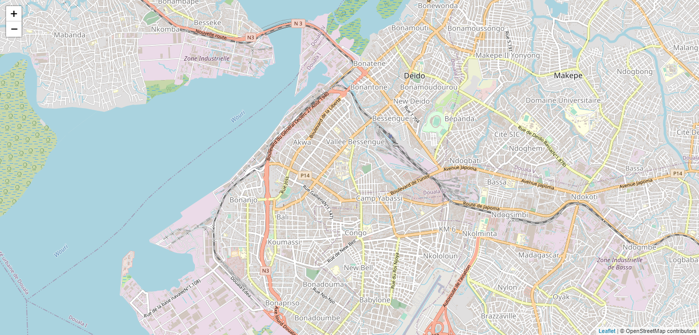

# ONACUT
## Introduction
Onacut is web application that notifies users of electricity, water or internet outage in their location. This project is inspired by [this web app](https://xn--strungsauskunft-9sb.de/stromausfall)

## TABLE OF CONTENTS
1. [About](docs/ABOUT.md)
2. [Installation](docs/INSTALLATION.md)

## License
MIT

